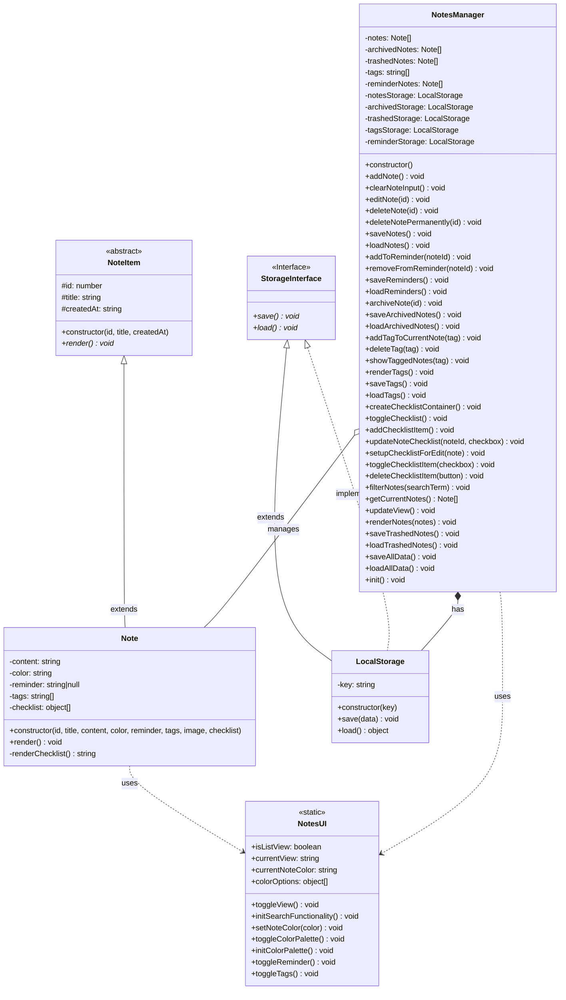

```mermaid
classDiagram
    %% Abstract class NoteItem
    class NoteItem {
        <<abstract>>
        #id: number
        #title: string
        #createdAt: string
        +constructor(id, title, createdAt)
        +render()* void
    }

    %% Note class extending NoteItem
    class Note {
        -content: string
        -color: string
        -reminder: string|null
        -tags: string[]
        -checklist: object[]
        +constructor(id, title, content, color, reminder, tags, image, checklist)
        +render() void
        -renderChecklist() string
    }

    %% Storage Interface
    class StorageInterface {
        <<Interface>>
        +save()* void
        +load()* void
    }

    %% LocalStorage Implementation extending storage interface
    class LocalStorage {
        -key: string
        +constructor(key)
        +save(data) void
        +load() object
    }

    %% NotesUI Static Class
    class NotesUI {
        <<static>>
        +isListView: boolean
        +currentView: string
        +currentNoteColor: string
        +colorOptions: object[]
        +toggleView() void
        +initSearchFunctionality() void
        +setNoteColor(color) void
        +toggleColorPalette() void
        +initColorPalette() void
        +toggleReminder() void
        +toggleTags() void
    }

    %% NotesManager Class
    class NotesManager {
        -notes: Note[]
        -archivedNotes: Note[]
        -trashedNotes: Note[]
        -tags: string[]
        -reminderNotes: Note[]
        -notesStorage: LocalStorage
        -archivedStorage: LocalStorage
        -trashedStorage: LocalStorage
        -tagsStorage: LocalStorage
        -reminderStorage: LocalStorage
        +constructor()
        +addNote() void
        +clearNoteInput() void
        +editNote(id) void
        +deleteNote(id) void
        +deleteNotePermanently(id) void
        +saveNotes() void
        +loadNotes() void
        +addToReminder(noteId) void
        +removeFromReminder(noteId) void
        +saveReminders() void
        +loadReminders() void
        +archiveNote(id) void
        +saveArchivedNotes() void
        +loadArchivedNotes() void
        +addTagToCurrentNote(tag) void
        +deleteTag(tag) void
        +showTaggedNotes(tag) void
        +renderTags() void
        +saveTags() void
        +loadTags() void
        +createChecklistContainer() void
        +toggleChecklist() void
        +addChecklistItem() void
        +updateNoteChecklist(noteId, checkbox) void
        +setupChecklistForEdit(note) void
        +toggleChecklistItem(checkbox) void
        +deleteChecklistItem(button) void
        +filterNotes(searchTerm) void
        +getCurrentNotes() Note[]
        +updateView() void
        +renderNotes(notes) void
        +saveTrashedNotes() void
        +loadTrashedNotes() void
        +saveAllData() void
        +loadAllData() void
        +init() void
    }

    %% Relationships
    NoteItem <|-- Note : extends
    StorageInterface <|-- LocalStorage : extends
    StorageInterface <|.. LocalStorage : implements
    NotesManager *-- LocalStorage : has
    NotesManager o-- Note : manages
    Note ..> NotesUI : uses
    NotesManager ..> NotesUI : uses

```